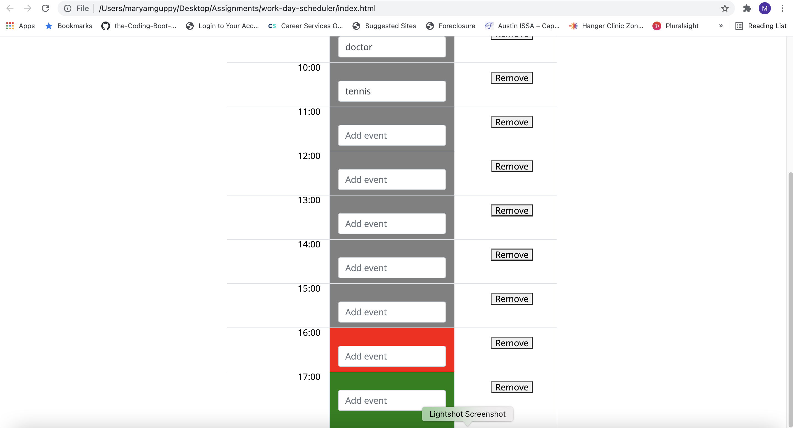

# work-day-scheduler
For this project, the following acceptance criteria was followed - 
GIVEN I am using a daily planner to create a schedule
WHEN I open the planner
THEN the current day is displayed at the top of the calendar
WHEN I scroll down
THEN I am presented with timeblocks for standard business hours
WHEN I view the timeblocks for that day
THEN each timeblock is color coded to indicate whether it is in the past, present, or future
WHEN I click into a timeblock
THEN I can enter an event
WHEN I click the save button for that timeblock
THEN the text for that event is saved in local storage
WHEN I refresh the page
THEN the saved events persist

I built a work day scheduler that should assist the user in planning their activities throughout the day.  When the user loads the page, they are presented with a grid of timeslots throughout the day where they can add their plans.  If the time is in the past, the timeblock text input box is gray.  If the hour is current, the timeblock text input box is red and if time is in the future, the timeblock text input box is green.  When a user types an event into the text input, the event along with the hour of the event is saved into local storage and if the page is refreshed, the events display that the user already had saved in local storage.  

Github link - https://github.com/mguppy/work-day-scheduler

Credits: w3schools.com, my tutor, classmates and my programmer husband